## **1. 권장되지 않는 자료구조, Stack**

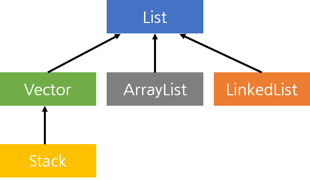

알고리즘 문제에서 스택이 필요할 때 Stack을 쓰면 되지만, Java에서는 보통 ArrayDeque가 더 빠릅니다. 이는 Stack이 내부적으로 **Vector의 동기화(synchronized) 설계**를 그대로 물려받았기 때문입니다. 알고리즘 풀이는 대부분 단일 스레드에서 돌기 때문에 이 동기화 비용은 굳이 안 써도 되는 비용이고, 누적되면 성능 차이가 체감되기 시작합니다.

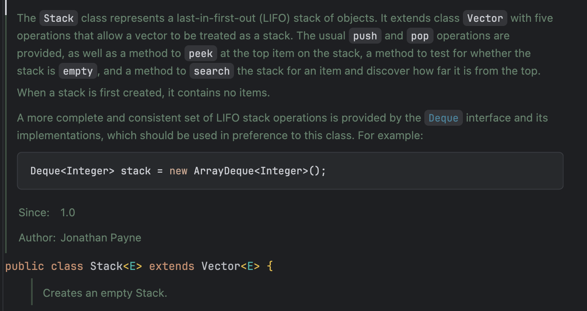

실제로 Java 공식문서나 Stack의 내부 코드를 들어가보면 LIFO stack을 위해 ArrayDeque를 사용하는 것을 권장하고 있는 것을 볼 수 있습니다.

그 이유는 무엇일까요? 이는 Stack이 가진 한계인 Vector 상속과 그로 인한 불필요한 동기화 비용 때문입니다.

---

## 2. Vector는 왜 존재할까?

Vector는 Java 초기(1.0) 시절, 동적 배열을 표준으로 제공하기 위해 만들어졌습니다. 지금 관점에서 보면 ArrayList가 그 역할을 더 자연스럽게 하지만, 당시 설계자들은 "모든 컬렉션은 멀티스레드 환경에서 안전해야 한다"는 철학을 가지고 있었고, 이를 위해 모든 주요 메서드에 `synchronized` 키워드를 붙였습니다.

**ArrayList의 add**

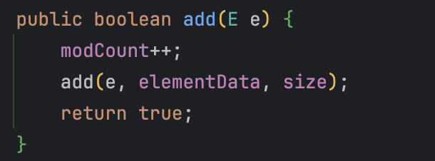

**Vector의 add**

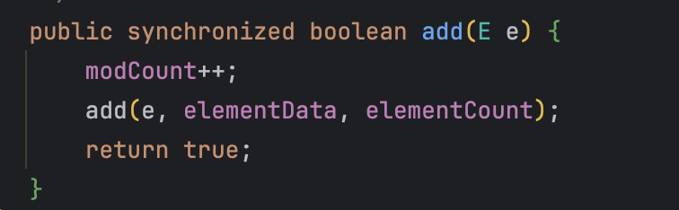


## **3. synchronized 키워드가 뭘까?**

`synchronized`는 말 그대로 java의 동기화 키워드입니다. 여러 스레드가 동시에 같은 객체의 특정 코드(메서드/블록)에 접근하지 못하게 막는 동기화 장치입니다. 즉, 한 스레드가 해당 영역을 실행 중이면 다른 스레드는 락(lock)을 얻을 때까지 대기합니다.

### 자바의 락과 모니터 개념

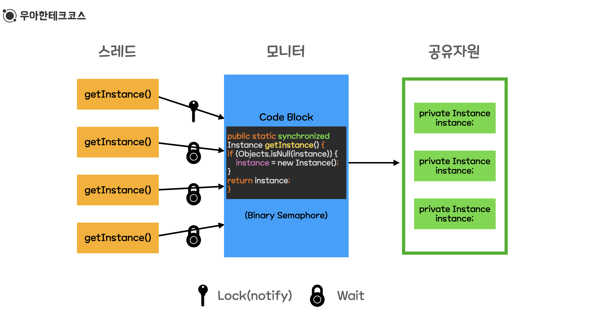

자바의 synchronized는 “객체 단위”로 동기화를 겁니다. 따라서, 모든 객체는 모니터 락을 통해 보호될 수 있는 모델입니다.

- **락(Lock)**
    - 공유 객체에 여러 스레드가 동시에 접근하지 못하도록 막는 장치
    - 동기화가 필요한 순간에만 사용
- **모니터(Monitor)**
    - synchronized가 적용된 코드에 진입하려는 스레드가 있을 때, JVM이 해당 객체의 락 사용 여부를 검사하고 관리

### synchronized 흐름도

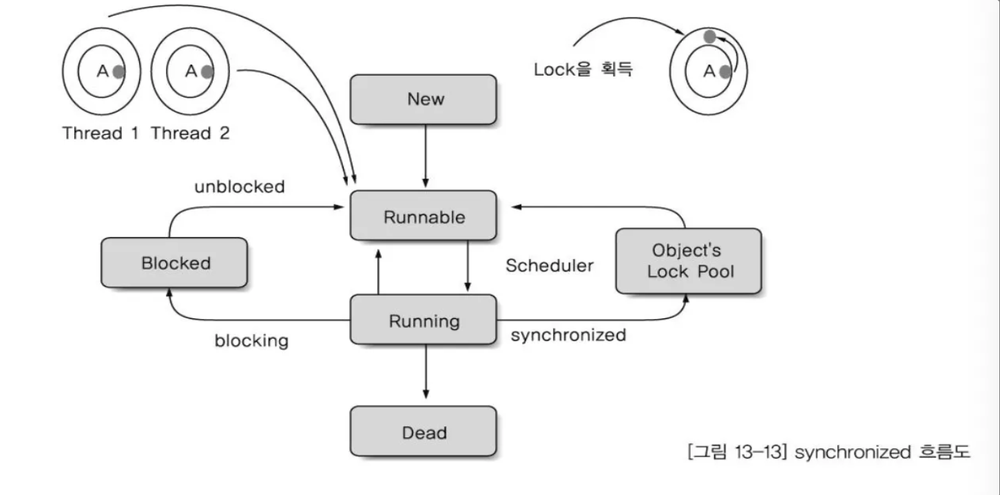

1. Thread 1이 객체 A의 synchronized 영역에 진입
    - 객체 A의 모니터 락을 획득 (monitorenter)
    - Running 상태에서 임계 영역 실행
2. Thread 2가 같은 객체 A의 synchronized 영역에 진입 시도
    - 락이 이미 사용 중이므로 즉시 진입 불가
    - **Object’s Lock Pool에 등록**
    - 상태는 Blocked
3. Thread 1이 synchronized 영역을 종료
    - 락 반환(monitorexit)
4. JVM이 대기 중인 스레드 중 하나를 깨워서 락 획득 경쟁으로 이동
    - Blocked → Runnable (unblocked)
    - 이후 스케줄러에 의해 Running으로 올라가 락 획득 후 실행

### synchornized가 성능에 영향을 주는 이유

synchornized는 공유 자원에 대한 동시 접근을 막아 데이터 일관성을 보장합니다.

하지만 단일 스레드 환경에서는 이 동기화가 다음의 비용을 발생하여 성능을 저하시킵니다.

- 락 획득 및 해제 비용
- JVM 모니터 상태 확인 비용

---

## 4. Stack은 동기화된다.

Java의 Stack 구현체는 이름만 스택이지, 사실상 구현은 “Vector + 스택 API”입니다.

- push(e) : 내부적으로 Vector의 addElement(e) 호출
- pop() : 내부적으로 removeElementAt(size - 1) 호출

즉, 모든 메서드에서 Vector 메서드를 호출하기 때문에 `synchronized` 키워드가 달려있습니다!

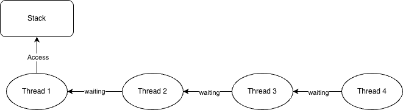

따라서, 위 그림처럼 Stack에는 하나의 Thread 밖에 접근하지 못하고 나머지 Thread들은 Stack 접근을 위해 Blocked 상태로 대기해야 합니다.

이를 **Thread-Safe**하다고 합니다.

하지만, Thread-Safe한 것은 멀티 스레딩 환경에서 데이터를 접근하는데는 유리하지만, 성능적으로는 불리합니다.

스택은 연산을 한번 할 때마다 다음과 같은 과정을 거치게 됩니다.

1. 모니터 락 획득
2. 배열 범위 체크 + 필요 시 확장
3. 데이터 저장 / 삭제
4. 모니터 락 해제

이게 수십만, 수백만 번 반복되는 알고리즘에서는 누적 비용이 됩니다.

---

## 5. Stack과 ArrayDeque의 동기화(Thread-Safe) 유무 확인

실제로 Stack은 멀티스레드 환경에서 안전한지, ArrayDeque는 데이터 유실이 발생하는지 테스트 코드로 확인해봅시다.

```java
public class SynchronizationTest {
    public static void main(String[] args) throws InterruptedException {
        Stack<Integer> stack = new Stack<>();
        Deque<Integer> deque = new ArrayDeque<>();

        new Thread(() -> {
            for(int i = 0; i < 10000; i++) {
                stack.push(1);
                deque.push(1);
            }
        }).start();

        new Thread(() -> {
            for(int i = 0; i < 10000; i++) {
                stack.push(1);
                deque.push(1);
            }
        }).start();

        new Thread(() -> {
            try {
                Thread.sleep(2000);

                System.out.println("Stack 최종 크기: " + stack.size()); // 10000 출력
                System.out.println("ArrayDeque 최종 크기: " + deque.size()); // 10000보다 작거나 에러 발생
            } catch (InterruptedException ignored) {
            }
        }).start();

    }
}
```

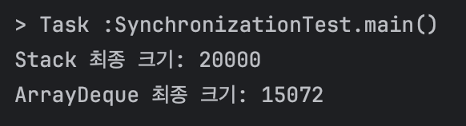

결과적으로, Stack은 동기화 덕분에 정확한 크기를 유지하지만, ArrayDeque는 여러 스레드가 동시에 인덱스를 수정하며 데이터 유실(Race Condition)이 발생합니다.

### ArrayDeque가 데이터 유실되는 이유

ArrayDeque의 최종 크기가 작은 이유는 Race Codition의 대표 문제 중 하나인 중복 쓰기가 일어났기 때문입니다.

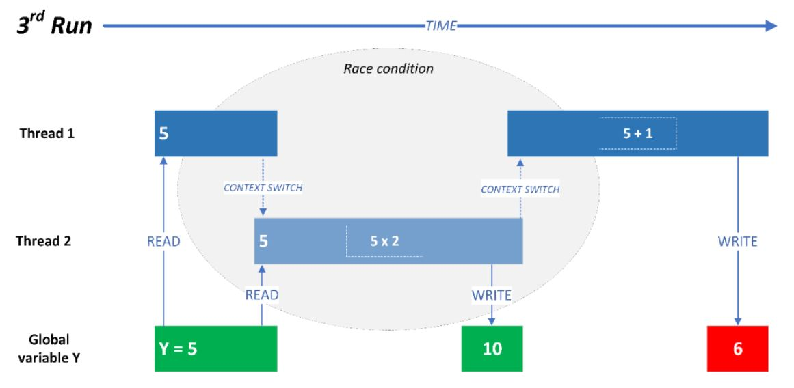

위 사진과 같이 두 스레드가 하나의 임계 영역에 접근하려고 할 때, 쓰기 작업이 겹치게 되면서 하나의 스레드가 write한 작업은 유실되어 버리는 것입니다.

### Stack vs ArrayDeque 성능 비교

싱글 스레드에서 각 자료구조의 성능을 비교해봅시다.

```java
public class PerformanceTest {
    public static void main(String[] args) throws InterruptedException {
        Stack<Integer> stack = new Stack<>();
        Deque<Integer> deque = new ArrayDeque<>();

        new Thread(() -> {
            long start = System.currentTimeMillis();

            for(int i = 0; i < 10000000; i++) {
                stack.push(1);
            }

            long end = System.currentTimeMillis(); // 코드 끝난 시간

            long time = end - start;
            System.out.println("Stack 속도: " + time + "m/s"); // 10000 출력
        }).start();

        new Thread(() -> {
            long start = System.currentTimeMillis();

            for(int i = 0; i < 10000000; i++) {
                deque.push(1);
            }

            long end = System.currentTimeMillis(); // 코드 끝난 시간

            long time = end - start;
            System.out.println("ArrayDeque 속도: " + time + "m/s"); // 10000 출력
        }).start();

    }
}
```

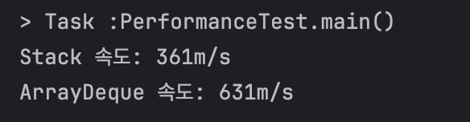

큰 차이가 안 날줄 알았는데 거의 2배 차이가 난다. 이로써 알고리즘 문제와 같은 동기화가 굳이 필요하지 않은 상황에는 ArrayDeque를 사용하는 것이 유리하다는걸 알 수 있습니다.

---

## 6. ArrayDeque를 동기화하고 싶다면? (대안과 한계)

ArrayDeque는 성능이 뛰어나지만 스레드 안전하지 않다는 단점이 있습니다. 만약 멀티스레드 환경에서 Stack의 대안으로 ArrayDeque만큼의 성능을 내면서 동기화까지 확보하고 싶다면, 보통 java.util.concurrent 패키지의 `ConcurrentLinkedDeque`를 대안으로 떠올리게 됩니다.

```java
Deque<Integer> concurrentDeque = new ConcurrentLinkedDeque<>();
```

### 이론적인 기대: 왜 ConcurrentLinkedDeque인가?

- **특징:** synchronized 대신 **CAS(Compare-And-Swap) 알고리즘**을 사용하여 락 프리(Lock-free) 방식으로 동작합니다.
- **기대 효과:** 여러 스레드가 동시에 접근해도 락을 획득하기 위해 대기(Blocked)하는 시간이 없으므로, Stack보다 훨씬 빠른 처리량을 보일 것이라고 예상했습니다.

> [!NOTE]
> **CAS (Compare-And-Swap)**
> </br> 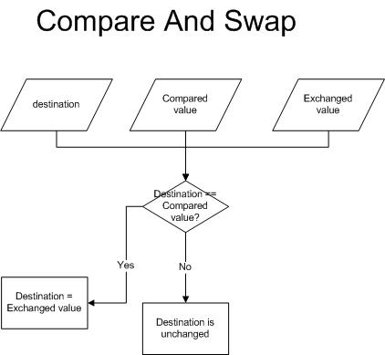 </br> 메모리의 값과 기존 값을 비교하여 일치할 때만 새 값으로 교체하는 원자적 연산입니다. 락을 사용하지 않고도 데이터 일관성을 보장하는 현대적인 동기화 기법입니다.
> > 저는 Lock & Monitor 방식을 비관락, CAS 방식을 낙관락과 비슷한 원리라고 생각하니 이해가 쉬웠습니다.

### 실제 성능 측정 결과

**[싱글 스레드 환경]**

> 하나의 스레드가 각각의 자료구조에 100만의 쓰기 작업 수행
>

```java
public class PerformanceTest {
    public static void main(String[] args) throws InterruptedException {
        Stack<Integer> stack = new Stack<>();
        Deque<Integer> deque = new ConcurrentLinkedDeque<>();

        new Thread(() -> {
            long start = System.currentTimeMillis();

            for(int i = 0; i < 10000000; i++) {
                stack.push(1);
            }

            long end = System.currentTimeMillis(); // 코드 끝난 시간

            long time = end - start;
            System.out.println("Stack 속도: " + time + "m/s"); // 10000 출력
        }).start();

        new Thread(() -> {
            long start = System.currentTimeMillis();

            for(int i = 0; i < 10000000; i++) {
                deque.push(1);
            }

            long end = System.currentTimeMillis(); // 코드 끝난 시간

            long time = end - start;
            System.out.println("ConcurrentLinkedDeque 속도: " + time + "m/s"); // 10000 출력
        }).start();

    }
}
```

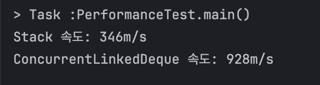

**[멀티 스레드 환경]**

> 10개의 스레드가 각각 100만 번의 쓰기 작업 수행
>

```java
public class PerformanceTest {
    private static final int THREAD_COUNT = 10;
    private static final int ITERATIONS = 1000000; // 100만 번 수행

    public static void main(String[] args) throws InterruptedException {
        // 1. Stack 테스트 (모든 메서드가 하나의 락을 공유)
        Stack<Integer> stack = new Stack<>();
        long stackTime = runTest(() -> {
            stack.push(1);
        });
        System.out.println("Stack 소요 시간: " + stackTime + "ms");

        // 2. ConcurrentLinkedDeque 테스트 (Lock-free 구조)
        Deque<Integer> concurrentDeque = new ConcurrentLinkedDeque<>();
        long concurrentTime = runTest(() -> {
            concurrentDeque.push(1);
        });
        System.out.println("ConcurrentLinkedDeque 소요 시간: " + concurrentTime + "ms");
    }

    private static long runTest(Runnable task) throws InterruptedException {
        Thread[] threads = new Thread[THREAD_COUNT];
        long start = System.currentTimeMillis();

        for (int i = 0; i < THREAD_COUNT; i++) {
            threads[i] = new Thread(() -> {
                for (int j = 0; j < ITERATIONS; j++) {
                    task.run();
                }
            });
            threads[i].start();
        }

        for (Thread t : threads) t.join();
        return System.currentTimeMillis() - start;
    }
}
```

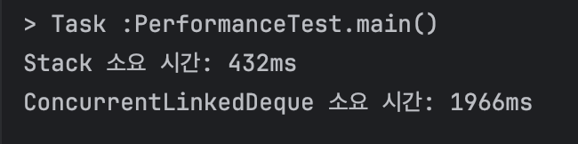

| 자료구조 | 내부 구현 구조 | 싱글 스레드 환경 | 멀티 스레드 환경 |
| --- | --- | --- | --- |
| Stack | 배열(Array) 기반 | 346ms | 432ms |
| ConcurrentLinkedDeque | 연결 리스트(Node) 기반 | 928ms | 1966ms |

하지만, 실제 성능 측정을 해보니 싱글 스레드와 멀티 스레드 모두 ConcurrentLinkedDeque가 훨씬 안 좋은 성능을 보였습니다.

### 성능 차이가 발생하는 이유

> Gemini + 약간의 뇌피셜
>
1. **메모리 할당 비용:** `Stack`은 배열 기반이라 인덱스만 수정하면 되지만, `ConcurrentLinkedDeque`는 매 삽입마다 새로운 `Node` 객체를 생성해야 합니다. 이 과정에서 힙 메모리 할당과 GC 부하가 발생합니다.
2. **캐시 효율성:** 배열은 메모리가 연속적이라 CPU 캐시 적중률이 높지만, 연결 리스트는 메모리가 파편화되어 있어 참조 효율이 떨어집니다.
3. **CAS 실패 비용:** 경합이 너무 심하면 CAS 연산이 계속 실패하고 재시도(Retry)하게 되는데, 이 비용이 `Stack`의 단순한 락 대기 시간보다 커질 수 있습니다.

---

## 7. 결론: 상황에 맞는 자료구조 선택하기

코드를 통해 확인했듯이, 락 프리(lock-free) 자료구조가 이론적으로는 좋아 보여도, 실제 환경에서는 메모리 할당, CAS 재시도, 캐시 미스 등의 오버헤드로 인해 더 느릴 수 있습니다. 따라서, 자료구조의 내부 구현 방식과 작업의 성격을 고려하여 적절한 자료구조를 선택하는 것이 중요합니다.

- **단일 스레드 환경(알고리즘 문제 풀이)**: ArrayDeque를 사용하는 것이 가장 합리적입니다. 동기화 비용이 없고, 배열 기반이라 캐시 효율이 좋아 빠르게 동작합니다.
- **멀티 스레드 환경(단순 LIFO 작업)**: 공유 스택이 꼭 필요하고 구현 단순성이 중요하다면 Stack도 선택지가 될 수 있습니다. 다만 Stack은 Vector 기반의 동기화로 인해 경쟁이 커질수록 급격히 느려질 수 있고, Vector 상속으로 인해 스택 의미와 무관한 API가 노출되는 점도 유의해야 합니다.
- **동시성 요구가 강한 병렬 처리 환경(블로킹 회피가 핵심인 경우)**: ConcurrentLinkedDeque는 양쪽 끝에서의 삽입/삭제가 동시에 빈번하게 발생하면서, 락 기반 동기화로 인한 스레드 블로킹(대기 상태 진입)을 가능한 한 피해야 하는 상황에서 고려할 수 있습니다. 특히 실시간성 또는 지연 변동(락 대기)에 민감한 경로에서, 락 대신 CAS 기반의 비차단 진행 특성이 유리하게 작용할 수 있습니다.

---

### 번외) 멀티스레딩 환경에서 FIFO는 성립할까?

> 결론부터 말하자면, 성립하지 않습니다.
> 

Java의 `synchronized` 키워드를 사용한 동기화는 기본적으로 **비공정(Unfair) 전략**을 취합니다. 즉, 락을 기다리는 스레드들 사이에 "삽입된 순서(LIFO)"가 보장되지 않습니다.

**[락 획득의 흐름]**

1. **Entry Set (Wait Set) 진입**: 특정 객체의 락이 이미 점유된 상태에서 다른 스레드가 `synchronized` 블록에 접근하면, 해당 스레드들은 `Blocked` 상태가 되어 객체의 **Entry Set**에서 대기합니다.
2. **락 해제 및 경쟁**: 락을 가진 스레드가 작업을 마치고 락을 반납(`monitorexit`)하면, Entry Set에 대기 중이던 스레드들이 다시 락을 얻기 위해 경쟁합니다.
3. **무작위성**: 이때 JVM은 대기 중인 스레드 중 어떤 스레드가 락을 가져갈지 보장하지 않습니다. 운이 좋은 스레드가 락을 가로챌 수 있으며, 먼저 기다리던 스레드가 계속해서 뒤처지는 기아 상태(Starvation)가 발생할 수도 있습니다.

**[공정한 동기화가 필요한 경우: ReentrantLock]**

만약 반드시 대기 순서에 따라 락을 획득해야 하는 상황(Fairness)이라면, `synchronized` 대신 `java.util.concurrent.locks.ReentrantLock`을 사용해야 합니다.

```java
// 생성자 파라미터로 true를 넘기면 공정성(Fairness) 모드로 동작합니다.
ReentrantLock lock = new ReentrantLock(true); 

lock.lock();
try {
    // 임계 영역 (Critical Section)
} finally {
    lock.unlock();
}
```

- **공정 모드(Fair Mode)**: 락이 해제되었을 때, 가장 오래 대기한 스레드가 락을 획득하도록 보장합니다.
- **성능 저하**: 공정성을 유지하기 위해 대기 큐를 관리하는 오버헤드가 발생하므로, 비공정 모드(`synchronized` 포함)보다 성능은 떨어집니다.


### 사진 출처 및 레퍼런스 
- https://icandooit.tistory.com/63
- https://tecoble.techcourse.co.kr/post/2021-10-23-java-synchronize/
- https://velog.io/@yarogono/CS-Race-condition%EC%9D%B4%EB%9E%80
- https://inpa.tistory.com/entry/JCF-%F0%9F%A7%B1-ArrayList-vs-Vector-%EB%8F%99%EA%B8%B0%ED%99%94-%EC%B0%A8%EC%9D%B4-%EC%9D%B4%ED%95%B4%ED%95%98%EA%B8%B0?pidx=6
- https://vanslog.io/posts/language/java/why-use-deque-instead-of-stack/
