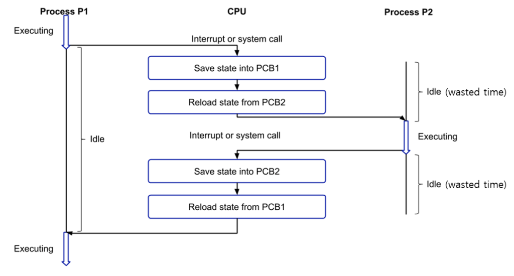
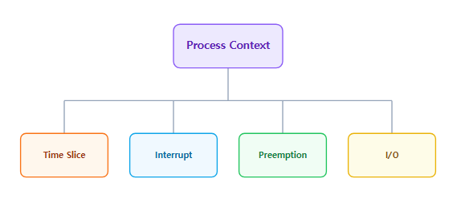
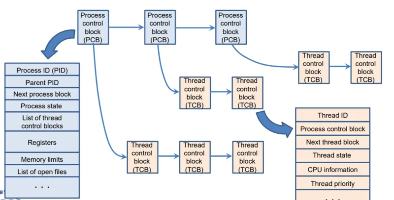
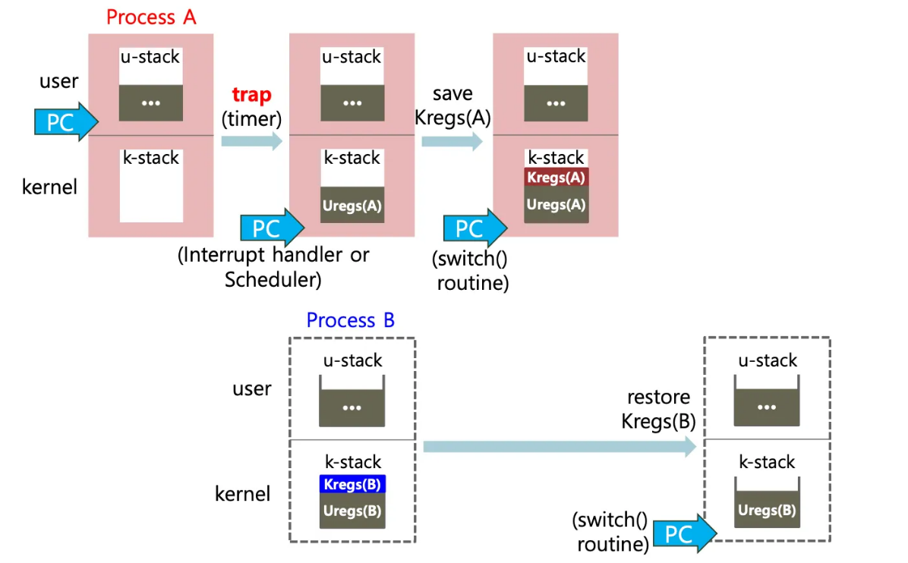
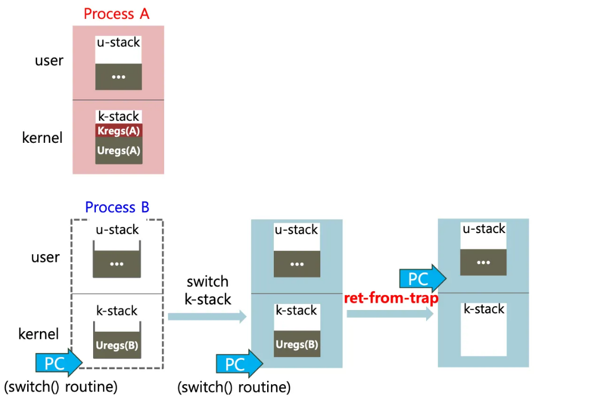
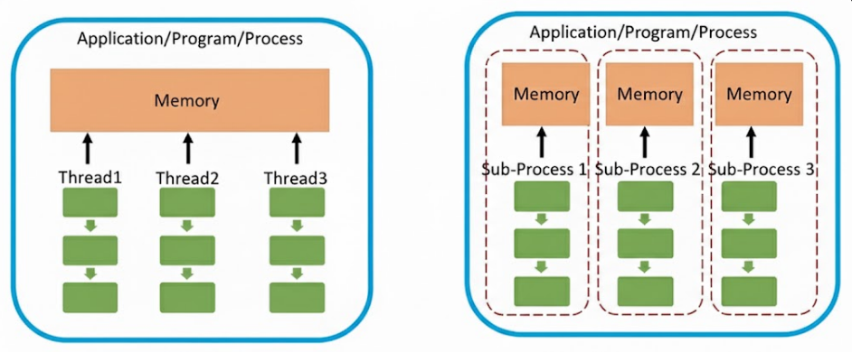
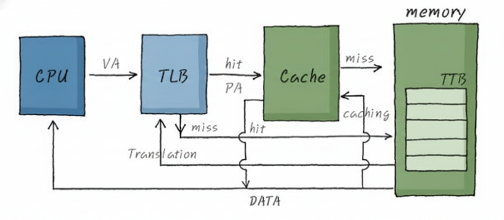
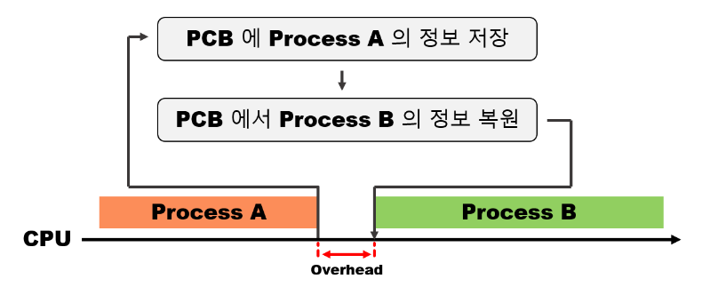
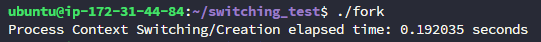

## 1. Context Switching의 정의 및 개념

**컨텍스트 스위칭**(Context Switching)이란 CPU나 코어에서 실행 중이던 프로세스나 스레드가 다른 프로세스나 스레드로 교체되는 과정을 말합니다.




- **컨텍스트(Context):** 프로세스나 스레드의 현재 상태 정보를 의미합니다. 여기에는 CPU 레지스터 상태(Program Counter, Stack Pointer 등)와 메모리 상태가 포함됩니다.
- **주체:** 운영체제의 **커널(Kernel)** 내 스케줄러가 이 과정을 관리하고 실행합니다.
- **필수성:** 멀티태스킹 시스템에서 여러 작업이 동시에 실행되는 것처럼 보이게 하여 사용자 응답성을 높이고 자원을 효율적으로 사용하기 위해 필수적입니다.

---

## 2. Context Switching의 발생 원인



컨텍스트 스위칭은 주로 다음과 같은 상황에서 트리거됩니다.

1. **Time Slice(Quantum) 소진:** 할당된 CPU 시간이 모두 경과했을 때 발생합니다.
2. **I/O 작업 요청 및 대기:** 입출력 작업이 필요하여 CPU가 쉬어야 하는 경우 다른 작업으로 전환합니다.
3. **인터럽트 발생:** 예기치 않은 이벤트나 시스템 호출이 발생했을 때 처리 권한을 넘깁니다.
4. **우선순위 선점(Preemption):** 현재 실행 중인 작업보다 우선순위가 높은 작업이 등장하면 CPU를 양보합니다.

---

## 3. 상태 저장소: PCB와 TCB

운영체제는 중단된 작업을 나중에 다시 시작하기 위해 상태 정보를 특정 자료구조에 저장합니다.

- **PCB (Process Control Block):** 프로세스 제어 블록은 프로세스의 PID, 상태, 프로그램 카운터, 레지스터 정보 등 프로세스에 관한 모든 정보를 담는 임시 저장소입니다.
- **TCB (Thread Control Block):** 스레드 제어 블록은 각 스레드마다 유지되는 정보로, TCB는 보통 PCB 내부에 포함됩니다. 스레드별 상태 정보, Stack 및 레지스터 포인터를 저장합니다.




스레드가 프로세스 내에 위치한 것처럼, TCB 또한 PCB 안에 들어있습니다. 위 그림에서 볼 수 있듯이, PCB와 TCB는 실제로 LinkedList로 구현되어 있는 형태입니다.

### Context Switching시 PCB/TCB가 저장 & 복원되는 과정

- 일정 시간 timer를 맞춰두고 Interrupt를 통해 Process Context Switching되는 모습



**[1단계: Process A에서 커널 모드로 진입 및 상태 저장 (그림 상단)]**

1. **Trap 발생**: 사용자 모드에서 실행 중이던 **Process A**에 타이머 인터럽트(timer)와 같은 trap이 발생합니다.
2. **User Register 저장**: 하드웨어는 현재 Process A의 사용자 레지스터 상태(`Uregs(A)`)를 해당 프로세스의 커널 스택(`k-stack`)에 자동으로 저장합니다. 이때 PC(Program Counter)는 커널의 인터럽트 핸들러나 스케줄러를 가리키게 됩니다.
3. **Kernel Register 저장**: 커널 내부의 `switch()` 루틴이 호출되면서, 현재 실행 중인 커널 모드의 레지스터 상태(`Kregs(A)`)를 다시 커널 스택에 저장합니다.

**[2단계: Process B로의 전환 준비 (그림 하단)]**

1. **Kregs(B) 로드**: 스케줄러가 다음에 실행할 프로세스로 **Process B**를 선택합니다.
2. **커널 상태 복원**: Process B의 커널 스택에 미리 저장되어 있던 커널 레지스터 정보(`Kregs(B)`)를 복원하기 시작합니다. 이때 PC는 여전히 커널 내의 `switch()` 루틴을 수행 중입니다.



**[3단계: 커널 스택 교체 및 복원 (그림 하단)]**

1. **Switch k-stack**: CPU의 스택 포인터가 Process A의 커널 스택에서 **Process B의 커널 스택**으로 완전히 교체됩니다. 이제부터는 Process B의 문맥에서 작업이 이루어집니다.
2. **Kernel Register 복원 완료**: Process B의 커널 레지스터 복원이 완료되면, `switch()` 루틴이 종료됩니다.

**[4단계: 사용자 모드 복귀 (그림 하단 우측)]**

1. **Return-from-trap**: 커널은 `iret` 또는 `ret-from-trap` 명령을 실행합니다. 이 과정에서 Process B의 커널 스택에 저장되어 있던 사용자 레지스터(`Uregs(B)`)를 실제 CPU 레지스터로 복구합니다.
2. **Process B 실행**: PC가 Process B의 사용자 코드 주소를 가리키게 되며, Process B가 이전에 멈췄던 지점부터 다시 실행을 시작합니다.

---

## 4. 프로세스 vs 스레드

앞에서 살펴보았듯, 프로세스와 스레드의 Context Switching 과정 모두 **커널 모드 전환 + CPU register 상태 교체** 과정을 동반합니다. 그렇다면, 두 Context Switching은 어디에서 차이가 나는걸까요?

프로세스와 스레드의 컨텍스트 스위칭 속도 차이가 발생하는 근본적인 원인은 그들이 메모리 자원을 공유하는 **구조적 차이**에 있습니다.

### 구조적 차이



- **프로세스(Process)**: 실행 중인 프로그램의 독립적인 인스턴스입니다. 운영체제로부터 독립된 메모리 영역(**Code, Data, Heap, Stack**)을 할당받습니다. 따라서 한 프로세스가 다른 프로세스의 자원에 직접 접근할 수 없습니다.
- **스레드(Thread)**: 프로세스 내에서 실행되는 흐름의 단위입니다. 같은 프로세스에 속한 스레드들은 **Code, Data, Heap 영역을 서로 공유**하며, 개별적인 실행 흐름을 유지하기 위해 오직 **Stack** 영역만 독립적으로 할당받습니다.
    
    > 각 스레드는 독립적은 Stack 영역을 할당받기 때문에 위에 나온 TCB 저장 & 복원 과정을 수행 가능하게 됩니다.
    > 

### 프로세스 Context Switching vs 스레드 ContextSwitching

프로세스와 스레드 모두 커널 모드로 진입하여 CPU 레지스터 상태를 저장하고 복원하는 공통적인 과정을 거치지만, **자원 공유 방식의 차이**로 인해 프로세스 컨텍스트 스위칭이 훨씬 무겁습니다.

1. **메모리 주소 공간 전환 (Address Space Switching)**
    
    프로세스는 운영체제로부터 독립된 가상 메모리 공간을 할당받기 때문에 프로세스 간 컨텍스트 스위칭이 발생하면 페이지 테이블(Page Table)을 교체해야 하며, CPU는 현재 가리키고 있는 메모리 주소 체계 자체를 완전히 바꿔야 합니다.
    
    반면, 스레드는 같은 프로세스 내에서 Code, Data, Heap 영역을 공유합니다. 스레드 컨텍스트 스위칭 시에는 메모리 주소 공간을 바꿀 필요 없이 실행 흐름(Stack 및 레지스터)만 교체하면 되므로 작업량이 훨씬 적습니다.
    
2. **TLB (Translation Lookaside Buffer) 캐시 Flush**
    
    성능 차이를 만드는 가장 결정적인 요인입니다. TLB는 가상 메모리 주소를 물리 주소로 빠르게 변환해주는 하드웨어 캐시입니다.




- **프로세스 스위칭:** 프로세스가 바뀌면 이전 프로세스의 가상 주소와 물리 주소 매핑 정보가 더 이상 유효하지 않습니다. 따라서 CPU는 안전을 위해 TLB를 완전히 비워버립니다(Flush). 전환 직후에는 캐시 미스가 빈번하게 발생하여 메모리 접근 속도가 급격히 떨어지는 '캐시 오염(Cache Pollution)' 현상이 나타납니다.
- **스레드 스위칭:** 동일 프로세스 내 스레드들은 메모리 주소를 공유하므로 TLB를 비울 필요가 없습니다. 이전 스레드가 사용하던 주소 매핑 정보를 그대로 사용할 수 있어 매우 효율적입니다.
3. **저장 및 복원 데이터의 무게 (PCB vs TCB)**
    
    관리해야 하는 정보량에서도 차이가 납니다.
    
    - **PCB (Process Control Block):** 프로세스 전체에 대한 제어 정보(메모리 맵, 열린 파일 목록, 사용자 정보 등)를 포함하므로 구조체가 크고 복잡합니다.
    - **TCB (Thread Control Block):** 스레드 고유의 상태 정보(PC, Register 세트, Stack Pointer)만 담고 있어 PCB보다 훨씬 가볍습니다. 따라서 커널 내에서 정보를 읽고 쓰는 오버헤드가 상대적으로 적습니다.

| **구분** | **프로세스 컨텍스트 스위칭** | **스레드 컨텍스트 스위칭** |
| --- | --- | --- |
| **공유 자원** | 없음 (독립적 공간) | Code, Data, Heap 공유 |
| **메모리 교체** | 페이지 테이블 교체 필요 | 교체 불필요 |
| **TLB 처리** | **Flush (모두 비움)** | **유지 (Flush 불필요)** |
| **오버헤드** | 높음 | 낮음 |

---

## 5. Context Switching = Pure Overhead



컨텍스트 스위칭은 애플리케이션 관점에서 보면 **순수 오버헤드**(Pure Overhead)입니다.

- **오버헤드(Overhead):** 상태 저장 및 복원 비용, 스케줄링 알고리즘 실행 비용 등이 실제 프로그램 로직과는 상관없이 CPU에 오버헤드가 발생합니다.
- **캐시 오염(Cache Pollution):** 컨텍스트 스위칭 직후에는 CPU 캐시에 현재 실행 중인 작업에 필요한 데이터가 없을 확률이 높습니다. 이로 인해 메모리 접근 시간이 증가하여 성능이 일시적으로 저하됩니다. 특히, 프로세스 전환 시에는 TLB까지 비워지므로 캐시 오염의 영향이 훨씬 치명적입니다.

---

## 6. 실습: 실제 성능 측정 비교

C 언어를 사용하여 1,000번의 프로세스 생성/전환과 스레드 생성/전환 시간을 측정해 보겠습니다. 이 코드는 작업을 수행한 후 즉시 종료하여 컨텍스트 스위칭을 유도합니다.

### 테스트 환경

1. **Hardware**
    - **Instance**: AWS EC2 (Intel Xeon Platinum 8259CL)
    - **CPU**: 2 vCPUs (1 Core, 2 Threads per Core)
    - **Clock Speed**: 2.50 GHz
    - **Architecture**: x86_64
    - **Hypervisor**: KVM (Full Virtualization)
2. **Cache Hierarchy**
    - **L1 Cache**: 64 KiB (d-cache: 32 KiB, i-cache: 32 KiB)
    - **L2 Cache**: 1 MiB
    - **L3 Cache**: 35.8 MiB

### 프로세스 컨텍스트 스위칭 측정 (fork)

```c
#include <stdio.h>
#include <unistd.h>
#include <sys/wait.h>
#include <sys/time.h>

int main() {
    struct timeval start, end;
    gettimeofday(&start, NULL);

    for (int i = 0; i < 1000; i++) {
        pid_t pid = fork();
        if (pid == 0) {
            // 자식 프로세스: 즉시 종료
            return 0;
        } else {
            // 부모 프로세스: 자식이 종료될 때까지 대기 (컨텍스트 스위칭)
            wait(NULL);
        }
    }

    gettimeofday(&end, NULL);
    double elapsed = (end.tv_sec - start.tv_sec) + (end.tv_usec - start.tv_usec) / 1000000.0;
    printf("Process Context Switching/Creation elapsed time: %f seconds\n", elapsed);
    return 0;
}
```

### 스레드 컨텍스트 스위칭 측정 (pthread)

```c
#include <stdio.h>
#include <pthread.h>
#include <sys/time.h>

void* thread_func(void* arg) {
    return NULL;
}

int main() {
    struct timeval start, end;
    pthread_t thread;
    gettimeofday(&start, NULL);

    for (int i = 0; i < 1000; i++) {
        pthread_create(&thread, NULL, thread_func, NULL);
        pthread_join(thread, NULL); // 스레드 종료 대기 (컨텍스트 스위칭)
    }

    gettimeofday(&end, NULL);
    double elapsed = (end.tv_sec - start.tv_sec) + (end.tv_usec - start.tv_usec) / 1000000.0;
    printf("Thread Context Switching/Creation elapsed time: %f seconds\n", elapsed);
    return 0;
}
```

### 결과 분석




실제로 코드를 리눅스(ubuntu) 환경에서 실행해 보면, **스레드 측정 결과가 프로세스보다 수십 배 더 빠르게 나타납니다.** 이는 앞서 언급한 MMU 설정 변경 및 TLB Flush 비용이 포함되지 않기 때문입니다. 

**사진 출처 및 레퍼런스**

http://yesxyz.kr/explanation-on-context-pcb-n-context-switching/

https://inpa.tistory.com/entry/%F0%9F%91%A9%E2%80%8D%F0%9F%92%BB-%ED%94%84%EB%A1%9C%EC%84%B8%EC%8A%A4-%E2%9A%94%EF%B8%8F-%EC%93%B0%EB%A0%88%EB%93%9C-%EC%B0%A8%EC%9D%B4